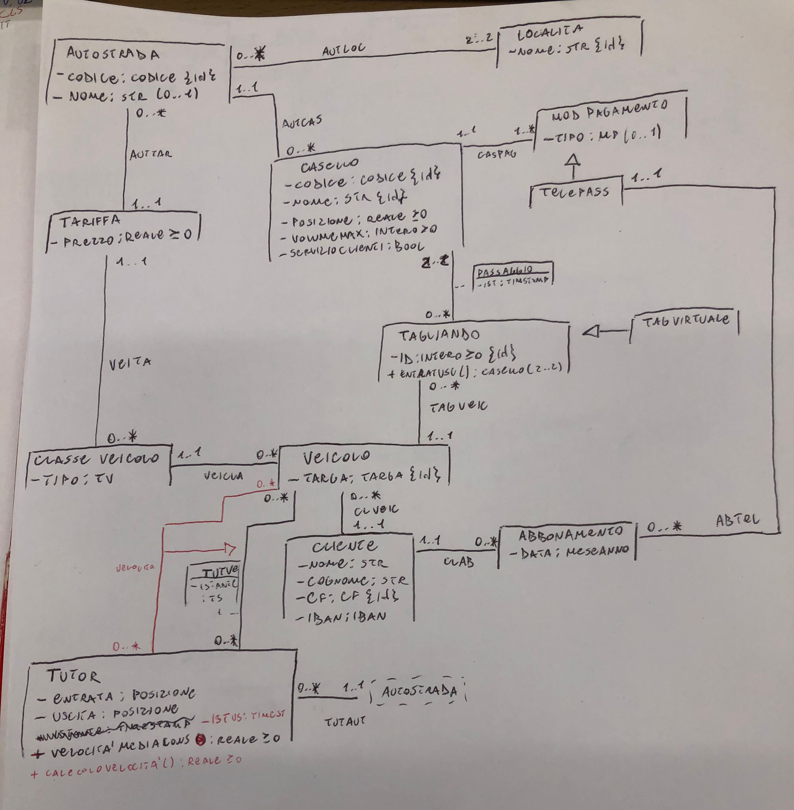
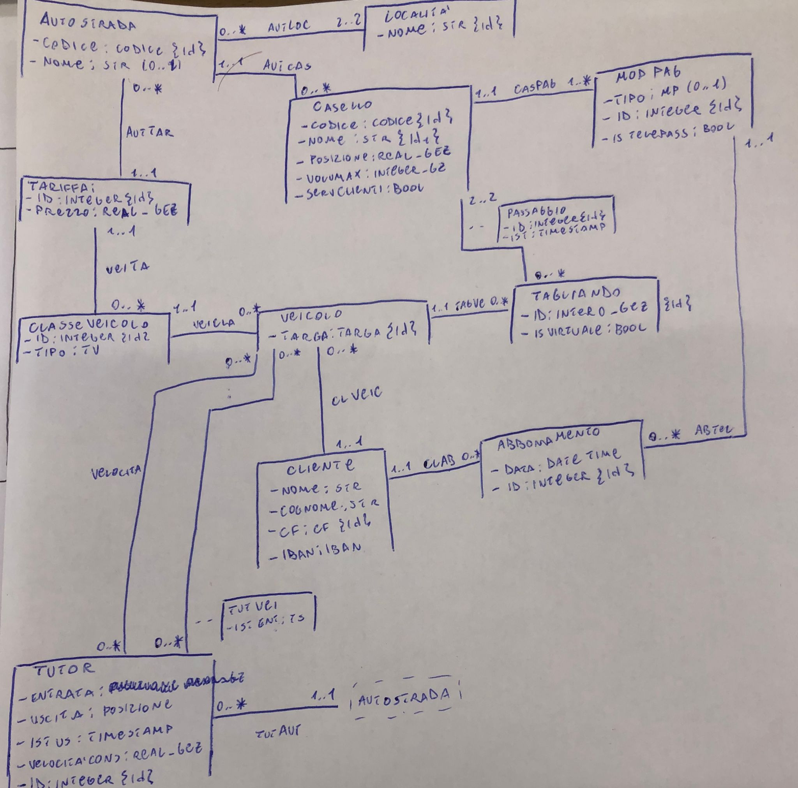

## Class diagram UML

### Specifica dei tipi di classe
#### Codice
Stringa alfanumerica formattata come da standard
#### Posizione
(KM:Reale >= 0, Localita: str)
#### Modalità Pagamento
Enumerazione = {"Contanti", "Carta di Credito", "Bancomat", "ViaCard"}
#### Targa
Stringa formattata come da standard
#### Tipo Veicolo
Enumerazione = {Tipo veicolo | Tipo Veicolo $\in$ Tipi Veicoli} # dovrebbe essere semplicemente una stringa

#### Codice fiscale
Stringa formattata come da standard
#### IBAN
Stringa formattata come da standard
#### Mese-Anno
DataOra(M,A)
## Vincoli di classe

### [V.Autostrada.Località]
*le Località collegate ad un autostrada devono essere diverse*

$\forall l,l',a \space|\space Autostrada(a) \wedge Localita(l) \wedge Localita(l') \wedge AutLoc(a,l) \wedge AutLoc(a,l') \implies l \not = l'$
### [V.Telepass.ClienteUnivoco]
*il telepass è univocamente legato ad un cliente abbonato*

$\forall t,t',c,c',a  \space|\space Telepass(t) \wedge Telepass(t') \wedge Cliente(c) \wedge Cliente(c') \wedge Abbonamento(a) \wedge Abbonamento(a') \wedge ClAb(c,a) \wedge ClAb(c',a') \wedge AbTel(a,t) \wedge AbTel(a',t') \implies t = t' \wedge c = c' \wedge a \not = a'$
### [V.ModalitàPagamento.Telepass]
*se la modalità di pagamento non è specificata, allora è telepass*
$\forall mp,t \space|\space ModalitaPagamento(mp) \wedge Tipo(mp,t) \wedge t = NULL \implies  \exists tp \space|\space Telepass(tp)$
### [V.TagliandoVirtuale.Telepass]
*se ho un TagliandoVirtuale allora è il cliente associato al veicolo  e paga con telepass*
$\forall t,cl,v,cs,mp \space|\space TagliandoVirtuale(t) \wedge Cliente(c) \wedge Veicolo(v)  \wedge Casello(cs) \wedge ClVeic(cl,v) \wedge TagVeic(t,v) \wedge Passaggio(t,cs) \implies CasPag(cs,mp) \wedge Telepass(mp)$

### [V.Casello.VolumeMax]
*il numero di veicoli al casello deve essere inferiore o uguale al VolumeMax*

### [V.Tagliando.CaselloEntrataUscita]
*il tagliando è associato ad un casello in entrata e ad uno in uscita e questi sono diversi e l'istante di entrata < l'istante di uscita*
$\forall t,i,i',ce,cu,pe,pu \space|\space Tagliando(t) \wedge Passaggio(t,ce) \wedge Passaggio(t,cu) \wedge Istante(t,ce,i) \wedge Istante(t,cu,i') \wedge Posizione(ce,pe) \wedge Posizione(cu,pu) \implies ce \not = cu \wedge i < i' \wedge pe < pu$
### [V.Posizione.Localita]
*La località deve essere una delle due associate all'autostrada*

### [V.Tutor.Continuità]
*L'istante del tutor deve essere compreso tra l'entrata e l'uscita del veicolo nel casello (istante entrata casello < istante passaggio tra i tutor < uscita casello*
$\forall v,t,tt,ce,cu,i,i',i'',e,u,p,p' \space|\space Veicolo(v) \wedge TagVeic(t,v) \wedge TutVe(tt,v) \wedge Passaggio(t,ce) \wedge Passaggio(t,cu) \wedge Posizione(ce,p) \wedge Posizione(cu,p') \wedge Istante(t,ce,i) \wedge Istante(t,cu,i') \wedge Istante(tt,v,i'') \wedge Entrata(tt,e) \wedge Uscita(tt,u) \implies p \le e \wedge u \le p' \wedge i \le i'' \wedge i'' \le i'$
### [V.Tutor.EntrataUscita]
$\forall t,e,u \space|\space Tutor(t) \wedge Entrata(t,e) \wedge Uscita(t,u) \implies e < u$
### [V.Veicolo.Disjoint]
*due veicoli  diversi non possono passare nello stesso casello nello stesso momento*
$\forall v,v',cs,t,t' \space|\space TagVeic(t,v) \wedge TagVeic(t',v') \wedge Passaggio(cs,t) \wedge Passaggio(cs,t') \wedge Istante(cs,t,i) \wedge Istante(cs,t',i') \wedge v \not = v' \wedge t \not t' \implies \not \exists t \space|\space i = t \wedge i' = t$

### [V.Tutor.Disjoint]
*due veicoli diversi non possono passare nello stesso tutor nello stesso istante*

### [V.Tutor.Velocita]
*Esiste un collegamento velocità da tutor a Veicolo sse la velocità del veicolo supera quella consentita*    

$\forall v,t,e,vm \space TutVei(v,t) \wedge Istante(v,t,e) CalcoloVelocita(t,v,e)=v' \wedge VelocitaMediaConsentita(t,vm) \wedge v' \ge vm \iff Velocita(v,t)$

## Use-Cases
### UML

### Segnatura delle operazioni:

### Tagliando.EntraEsci(): Casello (2..2)

**post-condizione:**

$C = \{ (c,c') | \exists i,i',p,p' \space Casello(c) \wedge Casello(c') \wedge Passaggio(this,c) \wedge Passaggio(this,c') \wedge Istante(this,c,i) \wedge Istante(this,c',i')\wedge Posizione(c,p) \wedge Posizione(c',p') \wedge i < i' \wedge p,p'\}$

$\text Result = C$

### Tagliando.Importo(): Reale $\ge$ 0

*Calcolo dell'importo del tagliando (tariffa * numero di km percorsi)*

**post-condizione:**

$I = \{(prezzo,pe,pu) |\space \exists v,cv,ta,a,ce,cu \space\space Tagliando.EntraEsci(this)=(ce,cu) \wedge  Posizione(ce,pe) \wedge Posizione(cu,pu) \wedge TagVeic(v,this) \wedge VeiCla(v,cv) \wedge VeiTa(cv,ta) \wedge AutTa(a,ta)\}$

$\text Siano: \space pe,pu,prezzo \in I\space \implies  KmPercorsi = pu - pe \wedge Tar = prezzo$ 

$Result = Tar * KmPercorsi$  

### Fatturazione(cl: Cliente, tp: Telepass, m: Mese, a: Anno): (Stringa, Stringa, DataOra, DataOra, Reale $\ge$ 0) (0..*)

*Fatturazione(Cliente Telepass,Mese,Anno)-> ottiene il conto del cliente nel Mese-Anno
(il conto contiene ogni addebito mensile, il nome dei caselli, la data e l'ora di entrata e uscita e l'importo)*

**pre-condizione:**
$\forall a',anno,mese \space ClAbb(cl,a') \wedge AbbTel(a',tp) \wedge Data(a',m,a) \wedge a=anno \wedge m=mese$

**post-condizione:**

$F = \{(nce,ncu,de,du,imp) \space|\space \exists v,t,ce,cu  \space \wedge ClVeic(cl,v) \wedge TagVeic(t,v) \wedge Tagliando.EntraEsci(t)=(ce,cu) \wedge Istante(ce,t,de) \wedge Istante(cu,t,du) \wedge CasPag(ce,tp) \wedge CasPag(cu,tp) \wedge Tagliando.Importo(t)=imp Nome(ce,nce) \wedge Nome(cu,ncu) \}$

$Result = F$

### Tutor.CalcoloVelocità(v: Veicolo, e: TimeStamp): Reale $\ge$ 0

*Calcolo velocità media di attraversamento nei tutor ->  velocità veicolo $>=$ della velocità consentitaClassDiagramHiWays salva i dati del passaggio*

**pre-condizione:**
$\exists i \space TutVe(v,this) \wedge Istante(v,this,i) \implies e = i$

**post-condizione:**

$\exists u,pe,pu \space TutVe(v,this) \wedge IstanteUscita(this,u) \wedge Entrata(this,pe) \wedge Uscita(this,pu)$

$Result = u-e * (pu-pe)$

## Ristrutturazione
### Class diagram UML

### Specifica dei tipi di dato

CREATE TYPE Str AS(
    String: VARCHAR(100)
);

CREATE TYPE CODICE AS(
    Value: Stringa di 3 caratteri formattata da standard
);

CREATE DOMAIN REAL_GEZ AS REAL CHECK(Value >= 0);

CREATE ENUM TIPO_VEICOLO AS { Classi dei veicoli.. }; # dovrebbe essere semplicemente una stringa

CREATE TYPE TARGA AS(
    String: Stringa Alfanumerica formattata da standard
);

CREATE DOMAIN INTEGER_GEZ AS INTEGER CHECK(Value >= 0);

CREATE DOMAIN INTEGER_GZ AS INTEGER CHECK(Value >= 0);

CREATE ENUM MODALITA_PAGAMENTO AS {"Contanti", "Carta di Credito", "Bancomat", "ViaCard"}

CREATE TYPE CF AS(
    String: Stringa Alfanumerica formattata da standard
);

CREATE TYPE POSIZIONE AS(
    String: Str,
    Localita: Località,
);

## Traduzione

## SQL Queries
