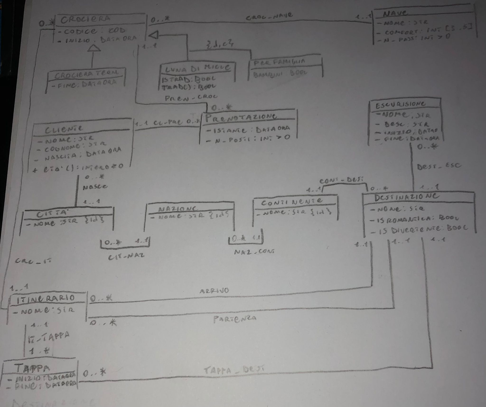

# Travel to the Moon

## Specifiche dei requisti

### Crociera

- codice
- data inizio $\wedge$ fine
- LunaDiMiele $\vee$ PerFamiglie (adatte ai bambini(?))
- le crociere LunaDiMiele possono essere:
  - tradizionali: numero di destinazioni romantiche $\ge$ destinazioni divertenti
  - alternative: numero di destinazioni romantiche $<$ destinazioni divertenti

### Nave: (associata a crociera)

- nome
- comfort
- num_passeggeri

### Prenotazione: (associata a crociera)

- istante di prenotazione
- numero di posti prenotati

### Destinazione: (associata a crociera)

- nome
- continente
- insieme di posti da vedere durante escursioni
- romantica $\wedge$ divertente

### Itinerario

- nome
- questo prevede una serie ordinata di destinazioni
- data ora arrivo e partenza (espresse come differenza con l'inizio della crociera)
- previsto da più di una crociera

### Escursione

- nome
- descrizione
- fascia oraria
- il sistema deve poter risalire ai posti da vedere in ogni singola destinazione        (usecase)

### Cliente: (prenota crociera)

- nome
- cognome
- età
- indirizzo
  
#### Funzionalità richieste del sistema

##### (1)  Ufficio prenotazioni Accetta/Rifiuta la prenotazione da parte del cliente

**Input** :

- Cliente
- Numero di posti
- Crociera

**Output**: bool

##### (2)  Ufficio marketing calcola l'età media dei clienti che hanno prenotato almeno una crociera esotica (continente $\not=$ Europa ) in un periodo dato

**Input** :

- Periodo (inizio,fine)

**Output**: Clienti (0..*)

##### (3)  Ufficio marketing calcola % delle destinazioni "Gettonate" in un certo periodo

**Nota: una destinazione è gettonata se: raggiunta da $\ge$ 10 crociere luna di miele $\vee$ $\ge$ 15 crociere per famiglie**

**Input** :

- Periodo (inizio,fine)

**Output**: (Destinazione,Reale $\ge$ 0) (0..*)

## Class diagram UML

## Specifica dei tipi di dato

### Crociera.COD

    Stringa formattata da standard

## Specifica delle Operazioni di classe

### Cliente.Eta(): Intero $\ge$ 0

### Destinazione.PostiDaVedere(): Escursione (0..*)

### LunaDiMiele.isTradizionale(): Bool

  **pre-condizione:**
  **post-condizione:**
  
    Raggruppo tutte le destinazioni romantiche e divertenti rispetto ad un itinerario
  $D = \{d \space|\space\exists i,t  \space\space CrIt(this,i) \wedge ItTappa(i,t) \wedge (TappaDest(t,d) \vee Arrivo(i,d) \vee Partenza(i,d)) \wedge isDivertente(d,True) \wedge isRomantica(d,False) \}$

  $R =\{r \space|\space\exists i,t  \space\space CrIt(this,i) \wedge ItTappa(i,t) \wedge (TappaDest(t,r) \vee Arrivo(i,r) \vee Partenza(i,r)) \wedge isDivertente(r,False) \wedge isRomantica(r,True) \}$

    Ritorno true se le destinazioni "Romantiche" sono >= delle "Divertenti" 
  $( |R| \ge |D|  \implies Result = True)\wedge ( |R| < |D|\implies Result = False)$

## Specifica dei Vincoli di classe

### [V.LunaDiMiele.TradizionaleAlternativa]

una crociera luna di miele è tradizionale $\iff$ numero di destinazioni romantiche $\ge$ destinazioni divertenti

$\exist c,i,d$ $LunaDiMiele(c) \wedge  CrcIt(c,i) \wedge$

### [V.Prenotazione.Continuita]

### [V.Prenotazione.NumeroPosti]

### [V.Itinerario.ArrivoPartenza]

### [V.Nave.Crociera]

### [V.Crociera.Tappe]

### [V.Crociera.InizioFine]

### [V.Tappa.Escursione]

### [V.Tappa.InizioFine]

### [V.Escursione.InizioFine]

### [V.Cliente.Continuita]
