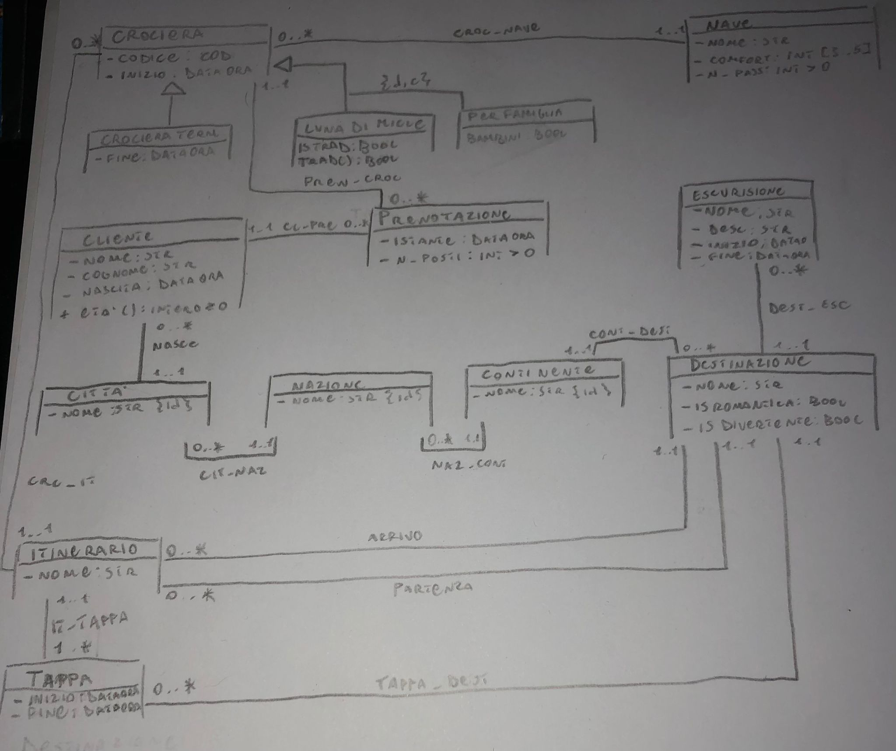
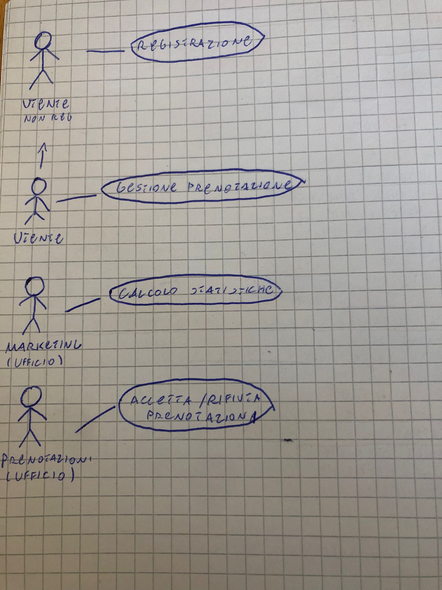
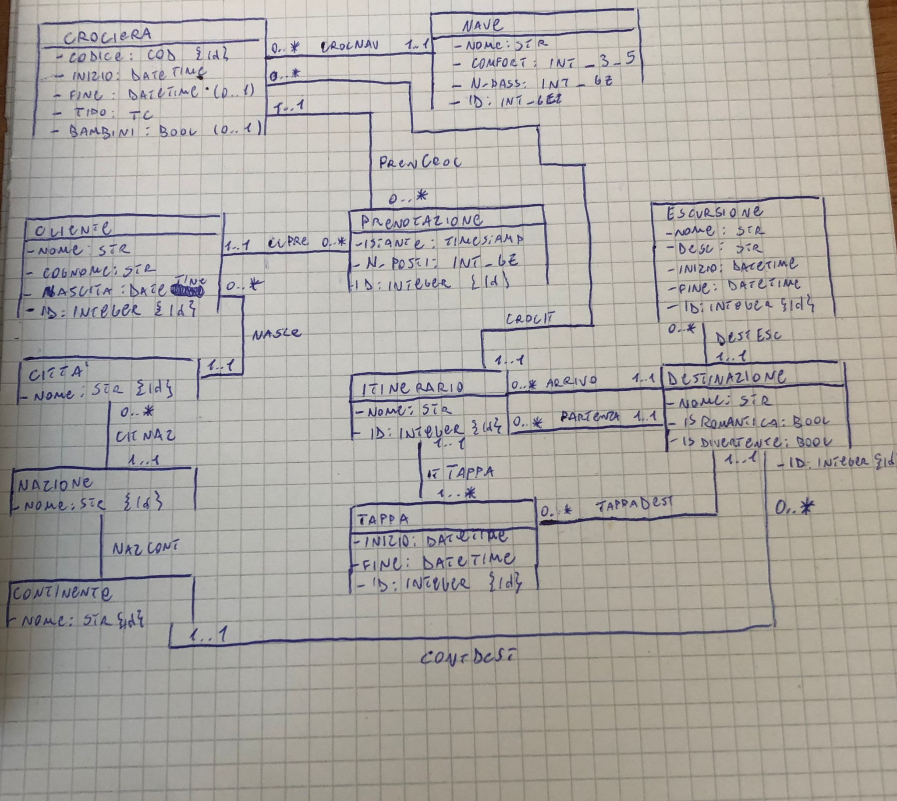

## Specifiche dei requisti


### Crociera

  

- codice

- data inizio $\wedge$ fine

- LunaDiMiele $\vee$ PerFamiglie (adatte ai bambini(?))

- le crociere LunaDiMiele possono essere:

- tradizionali: numero di destinazioni romantiche $\ge$ destinazioni divertenti

- alternative: numero di destinazioni romantiche $<$ destinazioni divertenti

  

### Nave: (associata a crociera)

  

- nome

- comfort

- num_passeggeri

  

### Prenotazione: (associata a crociera)

  

- istante di prenotazione

- numero di posti prenotati

  

### Destinazione: (associata a crociera)

  

- nome

- continente

- insieme di posti da vedere durante escursioni

- romantica $\wedge$ divertente

  

### Itinerario

  

- nome

- questo prevede una serie ordinata di destinazioni

- data ora arrivo e partenza (espresse come differenza con l'inizio della crociera)

- previsto da più di una crociera

  

### Escursione

  

- nome

- descrizione

- fascia oraria

- il sistema deve poter risalire ai posti da vedere in ogni singola destinazione (usecase)

  

### Cliente: (prenota crociera)

  

- nome

- cognome

- età

- indirizzo

#### Funzionalità richieste del sistema

  

##### (1) Ufficio prenotazioni Accetta/Rifiuta la prenotazione da parte del cliente

  

**Input** :

  

- Cliente

- Numero di posti

- Crociera

  

**Output**: bool

  

##### (2) Ufficio marketing calcola l'età media dei clienti che hanno prenotato almeno una crociera esotica (continente $\not=$ Europa ) in un periodo dato

  

**Input** :

  

- Periodo (inizio,fine)

  

**Output**: Reale $\ge$ 0

  

##### (3) Ufficio marketing calcola % delle destinazioni "Gettonate" in un certo periodo

  

**Nota: una destinazione è gettonata se: raggiunta da $\ge$ 10 crociere luna di miele $\vee$ $\ge$ 15 crociere per famiglie**

  

**Input** :

  

- Periodo (inizio,fine)

  

**Output**: (Destinazione,Reale $\ge$ 0) (0..*)

  

## Class diagram UML

  



  

## Specifica dei tipi di dato

  

### Crociera.COD

  

Stringa formattata da standard

  

## Specifica delle Operazioni di classe
### Destinazione.Escursioni(): Escursione (0..*)
  **pre-cond**
  
  **post-condizione:**
  $E = \set{e \space|\space DestEsc(this,e)}$
$Result = E$
### Cliente.Eta(): Intero $\ge$ 0

  

**pre-condizione**

**post-condizione:**

siano $i,n \space|\space Adesso(i) \wedge Nascita(this,n) \wedge Anno(i) \wedge Anno(n)$

$eta = i-n$

$Result = eta $

  

### Nave.PostiDisponibili(c: Crociera): Intero $\ge$ 0

**pre-condizione**

**post-condizione:**

Ricavo il numero di posti delle prenotazioni relative alla crociera che si riferisce a questa Nave

$P = \set{np | \exists p \space PrenCroc(p,c) \wedge CrocNav(c,this) \wedge NumPosti(p,np)}$

$sia \space T = pass \wedge NumPass(this,pass)$

$Posti = \sum{np \in P}$

$Result = T - Posti$

  

### Destinazione.PostiDaVedere(): Escursione (0..*)

### LunaDiMiele.isTradizionale(): Bool

  

**pre-condizione:**

**post-condizione:**

Raggruppo tutte le destinazioni romantiche e divertenti rispetto ad un itinerario

$D = \{d \space|\space\exists i,t \space\space CrIt(this,i) \wedge ItTappa(i,t) \wedge (TappaDest(t,d) \vee Arrivo(i,d) \vee Partenza(i,d)) \wedge isDivertente(d,True) \wedge isRomantica(d,False) \}$

  

$R =\{r \space|\space\exists i,t \space\space CrIt(this,i) \wedge ItTappa(i,t) \wedge (TappaDest(t,r) \vee Arrivo(i,r) \vee Partenza(i,r)) \wedge isDivertente(r,False) \wedge isRomantica(r,True) \}$

  

Ritorno true se le destinazioni "Romantiche" sono >= delle "Divertenti"

$( |R| \ge |D| \implies Result = True)\wedge ( |R| < |D|\implies Result = False)$

  

## Specifica dei Vincoli di classe
### [V.Prenotazione.Continuita]

  

$\forall c,c',p,i,i',n \space|\space ClPre(c,p) \wedge PrenCroc(p,c) \wedge Nascita(c,n) \wedge Istante(p,i) \wedge Inizio(c,i') \implies n < i \wedge i<i'$

  

### [V.Prenotazione.NumeroPosti]

  

$\forall n,c,p,np,ps,p' \space|\space NumPosti(p,np)\wedge NumPass(n,ps)\wedge PrenCroc(p,c)\wedge CrocNav(c,n) \wedge PostiDisponibili(n,p') \implies np < ps \wedge p' > 0$

  

### [V.Itinerario.ArrivoPartenza]

  

$\forall i,d,d' \space|\space Arrivo(i,d) \wedge Destinazione(i,d') \wedge d \not = d'$

  

### [V.Nave.CrocieraDisjointed]

  

$\forall n,c,c',i,i',f,f' \space|\space CrocNav(c,n)\wedge CrocNav(c',n) \wedge c \not = c' \wedge Inizio(c,i) \wedge Inizio(c',i') \wedge Fine(c,f) \wedge Fine(c',f') \implies \not \exists t \space|\space (i \le t \wedge t \le f) \wedge (i' \le t \wedge t \le f')$

  

### [V.Crociera.Tappe]

  

per ogni tappa dell'itinerario, deve esserci un ordine (le tappe sono comprese tra inizio e fine crociera)

$\forall i,t,c,i',i'',f,f' \space|\space CrocIt(c,i) \wedge ItTappa(i,t) \wedge Inizio(c,i') \wedge Fine(c,f) \wedge Inizio(t,i'') \wedge Fine(t,f') \implies i' \le i'' \wedge f' \le f$

  

### [V.Crociera.InizioFine]

  

$\forall c,i,f \space|\space CrocieraTerm(c) \implies i < f$

  

### [V.Tappa.Escursione]

  

per ogni escursione relativa alla destinazione, deve esserci un ordine (le escursioni sono comprese tra inizio e fine della tappa)

$\forall i,t,d,e,i',i'',f,f' \space|\space ItTappa(i,t) \wedge TappaDest(t,d) \wedge DestEsc(d,e) \wedge Inizio(t,i') \wedge Fine(t,f) \wedge Inizio(e,i'') \wedge Fine(e,f') \implies i' \le i'' \wedge f' \le f$


  

### [V.Tappa.Disjointed]

  

### [V.Destinazione.Disjointed]

  

### [V.Tappa.InizioFine]

  

### [V.Escursione.InizioFine]

  

### [V.Cliente.Continuita]

  

## Use-cases

### UML use-cases

  

### [1] Prenotazione(c: Cliente, p: Prenotazione, c': Crociera): bool

  

**pre-condizioni:**

$¬ CrocieraTerm(c') \wedge PrenCroc(c',p) \wedge ClPre(c,p)$

**post-condizione:**

$NumPosti(p) = postiPrenotati$

$\forall n \space|\space CrocNav(c',n) \wedge Nave.PostiDisponibili(n)=postiRimanenti$
$(postiRimanenti - postiPrenotati \ge 0 \implies Result = True) \wedge (postiRimanenti - postiPrenotati \le 0 \implies Result = False)$

  

### [2] CrocieraEsotica(i: DataOra, f: DataOra):Reale $\ge$ 0

  

**pre-condizione:**

  

$i < f$

  

**post-condizione:**

$C = \set{c | \exists  it,d,t,con,nome \space CrocieraTerm(c) \wedge CrocIt(c,it) \wedge (Arrivo(it,d) \vee Partenza(it,d) \vee ( ItTappa(it,t) \wedge TappaDest(t,d))) \wedge ContDest(con,d) \wedge Nome(con,nome) \wedge nome \not = Europa}$

$CL_{eta} = \set{eta \space|\space \exists c,p,c',i' Cliente(c) \wedge Eta(c)=eta \wedge ClPre(c,p) \wedge PrenCroc(p,c') \wedge c' \in C \wedge Inizio(c',i') \wedge i \le i' \wedge i' \le f}$

$Eta = \sum eta \in CL_{eta}$

$Result = \dfrac{Eta}{|CL_{eta}|}$

  

### [3.1] isGettonata(d: Destinazione, i: DataOra, f: Dataora):bool

  

**pre-condizione:**

$i \le f$

  

**post-condizione:**

  

$LDM = \set{c \space|\space \exists it,t,c,i',f' \space\space CrocIt(c,it) \wedge ItTappa(it,t) \wedge TappaDest(t,d) \wedge LunaDiMiele(c) \wedge Inizio(c,i') \wedge Fine(c,f') \wedge i \le i' \wedge f' \le f}$

  

$F = \set{c \space|\space \exists it,t,c \space\space CrocIt(c,it) \wedge ItTappa(it,t) \wedge TappaDest(t,d) \wedge PerFamiglie(c) \wedge Inizio(c,i') \wedge Fine(c,f') \wedge i \le i' \wedge f' \le f}$

  

$(|F| >= 15 \vee |LDM| >= 10 \implies Result = True) \space\wedge\space$ 

$(|F| < 15 \vee |LDM| < 10 \implies Result = False)$

  

### [3.2] CrociereItinerario(it: Itinerario, i: DataOra, f: DataOra):Crociera (0..*)

**pre-condizione:**

  

$i \le f$

  

**post-condizione:**

  

$C = \set{c | \exists i',f' \space \space CrocIt(c,it) \wedge Inizio(c,i') \wedge Fine(c,f') \wedge i \le i' \wedge f' \le f}$

$Result = C$

  

### [3] Gettonate(i: DataOra, f: DataOra):(Destinazione, Reale $\ge$ 0)(0..*)

  

**pre-condizione:**

$i \le f$

**post-condizione:**

  

$D = \set{(d,C=|\set{c | CrocieraItinerario(c,it,i,f)}|)\space | \space \exists c,it,t \space isGettonata(d,i,f )= True \wedge TappaDest(d,t) \wedge ItTappa(it,t) }$
$Tot = \sum_{d,C \in D}{C}$
*(numero totale delle crociere passanti per le destinazioni gettonate )*
  

$Result = \set{(d,p) | d,c \in D \wedge p = c * 100 / Tot}$

  

## Ristrutturazione
### Definizione dei tipi SQL

CREATE TYPE STR AS (
 String: varchar(200)
);

CREATE TYPE COD AS(
 Codice: str (Formattata come da standard)
);

CREATE TYPE TC AS ENUM {"LDM","PF"};
CREATE DOMAIN INT_GZ AS INTEGER CHECK(VALUE > 0);
CREATE DOMAIN REAL_GZ AS INTEGER CHECK(VALUE > 0);
CREATE DOMAIN INT_3_5 AS INTEGER CHECK(VALUE >= 3 $\wedge$ VALUE <= 5);
### Diagramma delle classi UML ristrutturato

  

## Traduzione

### Crociera
- Codice: COD (PK)
- Inizio: DateTime
- Fine*: DateTime
- Tipo: TC
- Bambini*: Bool
- Nave: Integer
- Itinerario: Integer

FK: Nave REF Nave(ID)
FK: Itinerario REF Itinerario(ID)
ENN: $Fine \not = NULL \iff Inizio < Fine$
Accorpato: CrocNave,CrocIt

### Nave
- Nome: str
- Comfort: INT_3_5
- N_Pass: INT_GZ
- ID: Integer (PK)

  

### Itinerario
- Nome: str
- ID: Integer (PK)
- Arrivo: Integer
- Partenza: Integer
- Tappa: Integer
FK: Arrivo REF Destinazione(ID)
FK: Partenza REF Destinazione(ID)
FK: Tappa REF Tappa(ID)
ENN: $Arrivo \not = Partenza$
Accorpa: Arrivo,Partenza,ItTappa

  

### Tappa
- Inizio: DateTime
- Fine: DateTime
- ID: Integer (PK)
- Destinazione: Integer
- Itinerario: Integer
FK: Destinazione REF Destinazione(ID)
FK: Itinerario REF Itinerario(ID)
ENN: $Inizio \le Fine$
Accorpa: TappaDest,ItTappa

  

### Destinazione
- Nome: str
- isRomantica: bool
- isDivertente: bool
- ID: Integer (PK)
- Continente: str
FK: Continente REF Continente(Nome)
Accorpa: ContDest

  

### Escursione
- Nome: str
- Desc: str
- Inizio: DateTime
- Fine: DateTime
- ID: Integer (PK)
- Destinazione: Integer
FK: Destinazione REF Destinazione(ID)
ENN: $Inizio < Fine$
Accorpa: DestEsc

  

### Prenotazione
- Istante: Timestamp
- N_Posti: INT_GZ
- ID: Integer (PK)
- Crociera: COD
- Cliente: Integer
FK: Cliente REF Cliente(ID)
FK: Crociera REF Crociera(Codice)
Accorpa: PrenCroc, ClPre

### Cliente
- Nome: str
- Cognome: str
- Nascita: DateTime
- ID: Integer (PK)
- Città: str
FK: Città REF Città(Nome)
Accorpa: Nasce
### Città
- Nome: str (PK)
- Nazione: str
FK: Nazione REF Nazione(Nome)
Accorpa: CitNaz

  

### Nazione
- Nome: str (PK)
- Continente: str
FK: Continente REF Continente(Nome)
Accorpa: NazContinente

  

### Continente
- Nome: str (PK)

### SQL Triggers
#### T.Crociera.Tappe

**Operazione di pre-inserimento:**
in Tappa (INSERT,UPDATE)
```SQL
isVALID = EXISTS(SELECT *
		  FROM Crociera cr, Itinerario it,
		  WHERE cr.Itinerario = it.ID 
		  AND new.Itinerario = it.ID
		  AND cr.Inizio <= new.Inizio 
		  AND new.Fine <= cr.Fine)
if isValid
	Commit
else
	Error
```
### SQL Queries

#### [1] DB.Prenotazione(c: Integer, p: Integer, cr:  COD): bool

```SQL
Pre-Cond = EXISTS(SELECT *
		FROM Crociera croc, Prenotazione pre, Cliente cl
		WHERE croc.codice = cr 
		AND pre.ID = p 
		AND cl.ID = c
		AND croc.Fine = NULL);

if !Cond 
	return Error;

NPosti = SELECT n.PostiDisponibili - pren.N_Posti                                   as PostiRimantenti 
		 FROM Crociera crc, Nave n, Prenotazione pren
		 WHERE crc.ID = cr 
		 AND n.ID = crc.Nave 
		 AND pren.ID = p

if NPosti.PostiRimanenti >= 0
	return True
else return False;

```
##### Nave.PostiDisponibili(n: Integer, c: Integer):

```SQL
Posti = SELECT Sum(p.NumPosti) as pst, nv.N_PASS as NPass, NPass - pst as R
		FROM Croc cr, Nave nv, Prenotazione p 
		WHERE cr.ID = c 
		AND cr.Nave = nv.ID 
		AND nv.ID = n
		AND p.Crociera = c
		GROUP BY nv.ID

Return Posti.R

```

#### [2] CrocieraEsotica(i : DateTime, f: DateTime): Real_GEZ

```SQL
if i >= f
	return Error

Esotiche = SELECT Avg(c.Eta) as Media
 		   FROM Crociera cr, Itinerario it, Destinazione ds,                      Tappa t, Cliente c, Prenotazione p
 		   WHERE ds.Continente != "Europa" 
		   AND (it.Arrivo = ds.ID OR it.Partenza = ds.ID OR 
			   (t.Itinerario = it.ID AND t.Destinazione = ds.ID))
		   AND cr.Itinerario = it.ID
		   AND p.Cliente = c.ID
		   AND p.Crociera = cr.ID
		   AND i <= cr.Inizio AND cr.Inizio <= f
Return Esotiche.Media   
```

#### [3] DestinazioniGettonate(i: DataOra, f: DataOra): set<Str,Real_GEZ>

```SQL
if i > f
	return Error
	
Gettonate = SELECT d.Nome , (NumCrociere.C*100/Sum(NumCrociere.C))                              as perc
			FROM Destinazione d, 
				(SELECT  Count(*) as C 
				FROM Tappa t3, Destinazione d3, Crociera cr3,                      Itinerario it3
				WHERE t3.Itinerario = it3.ID AND t3.Destinazione =                 d3.ID AND
				cr3.Itinerario = it3.ID AND cr3.Inizio <= i AND f                  <= cr3.fine) NumCrociere
			WHERE 
            (SELECT Count(*) as LDM FROM Crociera as cr1,                       Itinerario it1, Destinazione d1, Tappa t1 WHERE                    cr1.Inizio <= i AND f <= cr1.Fine AND it1.Crociera =               cr1.ID AND t1.Itinerario = it1.ID AND t1.Destinazione              = d1.ID AND cr1.Tipo = 'LDM') >= 10
			OR
            (SELECT Count(*) as F FROM Crociera as cr2, Itinerario             it2, Destinazione d2, Tappa t2 WHERE cr2.Inizio <= i               AND f <= cr2.Fine AND it2.Crociera = cr2.ID AND                    t2.Itinerario = it2.ID AND t2.Destinazione = d2.ID AND             cr2.Tipo = 'F') >= 15
			GROUP BY d.ID
return set<Gettonate.d,Gettonate.perc>
```